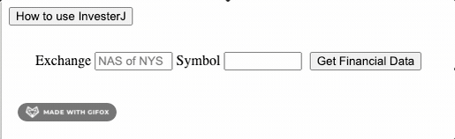

# InvestorJ

The purpose of the page is to load interesting segments from a company's balance sheet, income statement and cash flow statement. 
The items were selected by the author.  The user inputs the exchange value, either NAS for nasdaq or NYS for the NYSE and then puts
in the ticker of the stock they're looking up.

# Technologies Used: #
  ## Javascript is used to create the web page and perform the logic necessary to present the information
  
  ## JQuery is the command library used by javascript to insert lines into the screen.  
  
  ## HTML is used to create the basic structure of the page.
  
  ## CSS is used to style the web page.
  
  ## Ajax makes the call to the API.
  
  # Challenges:  
  1.  I initially created a framwork within my primary html display page in an attempt to help "organize" my thoughts
  and offer something hard coded to append to with jquery.  The problem is that I couldn't find a simple way to remove the information
  without logically removing the hard coded framework.  I finally decided to eliminate the interior entirely and code the framework as 
  a part of the jquery process.  Then when i emptied the content of the html div I was much happier with the result.

  
  Improvements:
  I got the responsive design part working right by fully understanding the diaplay:none css statement and then understanding the meaning of cascade in cascading style sheets.  I need to rip out the unnecessary code that is in my media reponse but I dare not do it before presentation day.
  
  I got the numbers to appear as $s by using the Intl.NumberFormat - this was actually a little hard to find but it works.
    
Additionally, I plan on adding links to financial articles on the site as well.  Off to the side at first and then resizing to beneath the financial data if the screen size gets small enough.

It is wednesday of project week and I'm going to work with the ajax call to try and trap ther errors so the user can get an appropriate response.  

Then I saw a sample readme file that had all this stuff in it......

Jvest

https://phxjrp3280.github.io/
A tidy web page that brings back interesting pieces of corporate financial statements

The page as you first arrive is a simple input screen: 
I have some really cool gif's and no idea how to import them.

Installation
Features
 - the code has a modal to instruct the user on what to do and..
 - the code has a carousel to display the same data over time for comparison purposes
 
Contributing

Team
-  my classmates were extremly useful in helping me and offering advice.

FAQ
- Is that all it does?  Yes, that is all it does.

Support
- the initial intent is to build the site and then abandon it entirely after it has been modified in such a way that it is a suitable personal marketing site.

License

Installation

Clone
Clone this repo to your local machine using phxjrp3280/phxjrp3280.github.io

Setup

Going into more detail on code and technologies used
  Javascript is used to create the web page and perform the logic necessary to present the information
  
  JQuery is the command library used by javascript to insert lines into the screen.  
  
  HTML is used to create the basic structure of the page.
  
  CSS is used to style the web page.
  
  Ajax makes the call to the API.
  
Contributing
I borrowed heavily from classroom examples.  Authors, whose techniques I blatenly mirrored (in alphabetical order) are , Jerrica Bobadilla, Matt Huntington,  Karolin Rafalski and Brendan Quirk

Step 1
Option 1

🍴 Fork this repo!
Option 2

👯 Clone this repo to your local machine using phxjrp3280/phxjrp3280.github.io
Step 2
HACK AWAY! 🔨🔨🔨
Step 3
🔃 Create a new pull request using https://github.com/joanaz/HireDot2/compare/.
Team
Or Contributors/People

Jvest Investors - where passive investing is an art.

Support
Reach out to me at one of the following places!

Website at biteme.com
Twitter at @biteme.again
